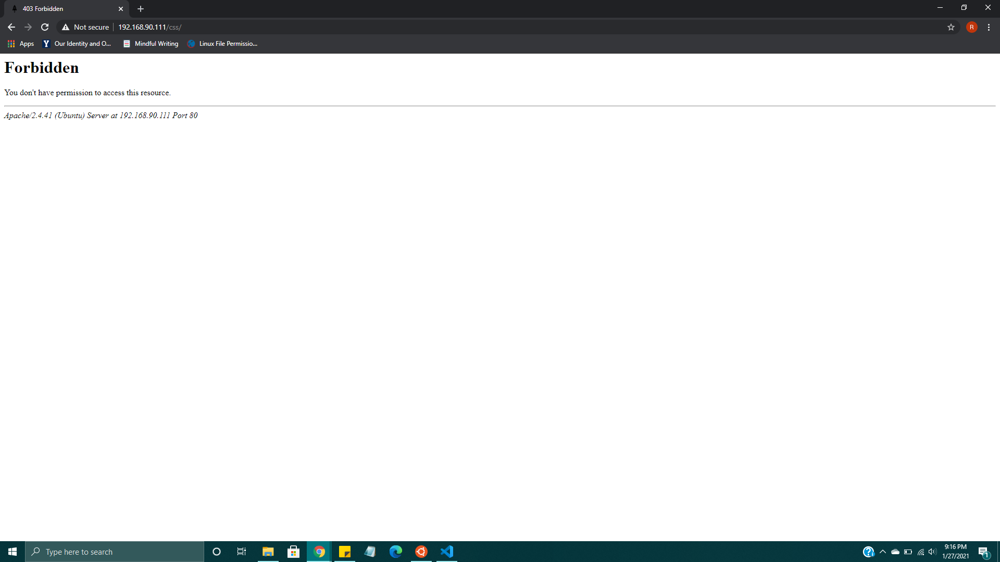

# I. Introduction

Rowan Bauer
01/27/21
Lab 1 - HTML & CSS

# II. Executive Summary

Lab 1 is a to do list webapplication.  This application is static and only contains HTML and CSS.  The web app includes a nav bar, a static form, some inactive switches, and a list of items.  Next I plan to add some Java to add some more functionality.

# III. Design Overview

The layout of the webpage before any action is taken

The webpage after switches have been engaged and the form is submitted without correct input

What happens when we try to access the style sheet

There are 12 files within the lab 1 folder:
1. lb_ss1.png is an example photo of what the page should look like
2. README.md within the instructions folder is the instructions for completing lab 1
3. style.css contains the style sheet, including bootstrap style adjustments and other visual changes
4. script.js is currently an empty file
5. favicon.ico is the icon that index.html uses for the tab in the browser
6. index.html contains all of the references to external files as well as the main body of code that the web browser will display
7. docker-compose.yml is for developing the webpage on my own environment
8. protected.png, webbasic.png, and webinputs.png are screenshots for documenting the webpage
9. README.md is this documentation for laying out the whole lab 1 repository

# IV. Questions

What is the purpose of using Docker containers?
- The docker containers allow us to test the functionality of the web page in a local invironment via localhost so we don't have to go through the whole process of sending it to the server and putting it up.

Why is it useful to have both a development environment and a live server environment?
- The live server environment is the final product that allows the webpage to be viewed by the consumer, whereas the development is much more convenient to update regularly while adjustments are being made.

What is the purpose of using a code versioning tool (i.e. git)?
- Code versioning tools allow us to break down the development process so we can easily document progress as well as more easily pinpoint errors in the code, like bugs.

What is the relationship between CSS and Bootstrap?
- Cascading Style Sheets is the programming language used to add layouts, while Bootstrap has many templates for CSS.

Describe how web browsers choose which CSS to use for an HTML element when the CSS rules contradict each other?
- The program runs each style in order, so the last style listed will overwrite all other styles.

List 2 reasons why using Bootstrap can be useful.
- Bootstrap saves a ton of time, because many styling aspects have already been created, so instead of reinventing the wheel, you can quickly search styles that have already been made.

Why would you disable directory access for your server?
- Directory access for the user is a security threat, because people wanting to hack your server survey for information that they can find, and knowing the contents of the directory gives them something they can exploit.

# V. Lessons Learned

## Problem 1. Local Host Browser Settings

When using Docker, if there is not a website to be served, localhost brings the user to localhost/tutorial/ which has the Docker tutorial documentation.  The browser saves the extension /tutorial/ which causes any other pages to be unaccesable under simply localhost.  To solve this, browser history must be cleared so that searching for localhost does not auto correct to localhost/tutorial.

## Promblem 2. Column Sizing

When using Bootstrap, there are many formats for using the grid layout.  When using the grid, be aware of the col-<number> because those are proportional to the page and to the close columns.

## Promblem 3. Bootstrap Coloring

When overwriting Bootstrap styles, the class from bootstrap need to be overwritten.It will not work to try to change the HTML tags directly, because the Bootstrap styles are weighted more heavily than tag styles.  

# VI. Conclusions

- Use VisualStudioCode and Docker for a development environment
- Work Github repositories
- Serve a fully functional pruduction environment
- Code in HTML
- Code in CSS
- Reference Bootstrap code
- How to code in markdown language
- Navigate the development environment through terminal

# References
- Help with markdown https://www.markdownguide.org/cheat-sheet/
- Icon resource https://fontawesome.com/
- All code help https://www.w3schools.com/
- All Bootstrap documentation https://getbootstrap.com/docs/5.0/getting-started/introduction/