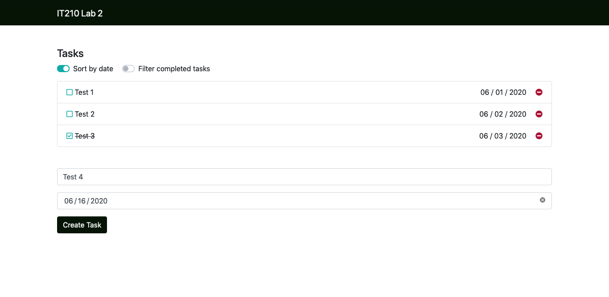

# Lab 1B - HTML & CSS

## Overview

In order to visualize content, most applications use some kind of markup language. Web browsers use HTML (**H**yper**T**ext **M**arkup **L**anguage) to organize the content on the screen, and CSS (**C**ascading **S**tyle **S**heets) to style the content. CSS is used to change things like font, colors, positioning, and even animations. JavaScript is used to execute logic on the website, if it's needed.

A nice metaphor for these basic components is the human body. HTML defines what is on the website, much like the skeleton. CSS makes everything look pretty and hides all the ugly parts, much like the skin. JavaScript manipulates what is on the website, much like the muscles.

You will be using what's called a "CSS Framework", or just a bunch of pre-written CSS files to style your application. This will allow you to make a professional-looking application with much less effort.

## Functionality

- Structure your project
- Write correct HTML
- Use a CSS Framework

## Concepts

- Project Structure
- HTML Syntax
- CSS Syntax
- CSS Variables
- CSS Frameworks
- Responsive app design

## Technologies

- HTML
- CSS
- Bootstrap.css
- Favicon

## Step 1: Set up your folder structure

A website is just a bunch of special files in a folder. You can create your website in any new folder, but in your case, you will want to use the `src` folder you created in Lab-1A.

Inside the `src` folder, if it's not already there, you will want to create the following, making folders as necessary:

- `src/index.html`
- `src/css/style.css`
- `src/js/script.js`

> Note: Apache automatically looks for a file called `index.html` and uses it as the default starting point when someone tries to view your website. You can edit the config files to change what the default starting point is.

## Step 2: Create your skeleton

HTML files have a certain structure that you'll need to conform to if you want it to work properly. The top of every HTML file will tell you which version of HTML you are using.

1. Add the first line to `index.html`:

    ```html
    <!DOCTYPE html>
    ```

    > This "tag" tells the browser to use HTML version 5, the latest version.

1. Add an html tag to contain your document:

    ```html
    <!DOCTYPE html>
    <html>

    </html>
    ```

    > You'll notice that this time you added two "tags". There is an opening and a closing tag associated with most HTML tags, but some tags don't need a closing tag, and some tags close themselves. You can find more information on the [w3school documentation](https://www.w3schools.com/html/html_intro.asp).

    > Each HTML page has `<head>` and `<body>` tags. The head is not visible, so it's a good place to connect your HTML page with other files, including your styles. You can also give a name to your website with the `<title>` tag.

    ```html
    <!DOCTYPE html>
    <html>

    <head>
      <title><!-- Add an appropriate name --></title>
      <!-- Links to stylesheets -->
    </head>

    <body>
      <!-- Your visible elements -->
      <!-- Links to scripts -->
    </body>

    </html>
    ```

    > You'll notice that the title tag is nested in the head tag. That's how HTML is organized. You'll also notice the indentation on tags that are nested in other tags. The browser doesn't care about indentation, but your co-workers will. Learn to properly indent your code now, or be forever hated.

For your task list application, create the following components using just HTML:

- A navigation bar (`<nav>`)
- A page title (`<h1>`)
- Two checkboxes (`<input type='checkbox'>`)
- An Unordered List (`<ul>`)
    - List Items (`<li>`) which each contain the following:
        - checkbox (`<input type='checkbox'>`)
        - A small bit of text (`<span>`)
        - A date (`<span>`) in the format `'MM-DD-YYYY'`
        - A button (`<button>`)
- A (`<form>`) that contains
    - A text input (`<input>`)
    - A date input (`<input type='date'>`)
    - A button (`<button>`)
    - The `required` attribute for both inputs

## Step 3: Add skin to the skeleton

No doubt you thought to yourself, this looks like a website made in the [90s](https://www.spacejam.com/). Well, that can be fixed with a CSS Framework!

The framework you will be using is called **Bootstrap**, which contains CSS that will make your website conform to a specific style. It was originally created by developers at Twitter. You can find more about its origin on the [Wikipedia page on Bootstrap](https://en.wikipedia.org/wiki/Bootstrap_(front-end_framework)).

You can get started by sticking in the one CSS tag and three JavaScript tags as directed on their [Getting Started](https://getbootstrap.com/docs/4.5/getting-started/introduction/) page in their documentation.

> Note: you will need to reference this documentation extensively when developing your application. Explore the documentation website after reading through the "Getting Started" page.

On the Getting Started page, you'll find a section called CSS. It provides a link to a file called `bootstrap.min.css` from `BootstrapCDN.com`. A **CDN** (**C**ontent **D**elivery **N**etwork) is a really efficient server that serves static files such as CSS files. You'll be using the CDN because you don't need to serve the Bootstrap resources yourself.

1. Copy the CSS `<link>` tag from the Getting Started page and paste it between the `<head>` tags. The [link tag](https://www.w3schools.com/tags/tag_link.asp) is used for between a document and an external resource, in your case, a CSS style framework file.

    > These tags take **attributes** that tell it certain information. The `<link>` tag needs a `rel`, and an `href` attribute. `rel` means the "relation" the linked file has to the current page. In this case it will be `rel="stylesheet"`. `href` means "hypertext reference", and is used mostly to add links to your page, but in this case, it tells the HTML where to find your stylesheet.

    ```html
    <!DOCTYPE html>
    <html>
      <head>
      <!-- title, meta, etc -->
      <link rel="stylesheet" href="https://stackpath.bootstrapcdn.com/bootstrap/4.5.0/css/bootstrap.min.css" integrity="sha384-9aIt2nRpC12Uk9gS9baDl411NQApFmC26EwAOH8WgZl5MYYxFfc+NcPb1dKGj7Sk" crossorigin="anonymous">
    </head>
    <!-- body -->
    </html>
    ```

    > Note: The `.min` in `bootstrap.min.css` means it's a minified version of the file. Minified files take all of the code and put it on a single line, which allows the browser to read the file faster, which means the page will load faster.

1. Copy the `<script>` CDN tags from the JS section into the bottom of your HTML `<body>` tag.

    > Note: Bootstrap comes with some JavaScript so that you can have pretty animations, and a few other things. You don't see any of the content in the JavaScript file directly on the webpage, so it's common practice to put the `<script></script>` tag at the bottom of the `<body>` tag so that it loads after everything that the user sees, which decreases **perceived** load time.
    
   > Note: Bootstrap, along with most CSS frameworks, uses **CSS Classes** to change the styles of the website. A class is just a bit of text that defines the tag it's on. You can share classes between multiple tags as well, and style them all the same.
   

2. To use the icons required in step 4 you will need to add the corresponding `<link>` tag to the `<head>`, **above** the CDN `<link>` tag:

    ```html
    <link href="https://fonts.googleapis.com/icon?family=Material+Icons" rel="stylesheet">
    ```
    > Note: You may use Google's material icons, or use [Font Awesome](https://fontawesome.com/)'s larger selection of icons, or [another icon provider](https://getbootstrap.com/docs/4.5/extend/icons/) you desire.
 

## Step 4: Add the styles

Start again from the top. Bootstrap provides a [Navbar](https://getbootstrap.com/docs/4.5/components/navbar/) class that you will use in your application.

> Note: It is okay to copy and paste examples from the documentation, and then edit it to meet the needs of your application.

1. Change your nav so it behaves like a [Navbar](https://getbootstrap.com/docs/4.5/components/navbar/).

1. Change your checkboxes so they behave like [Switches](https://getbootstrap.com/docs/4.5/components/forms/#switches).

1. In the Bootstrap documentation, find a way to display a list of items, and change your list so it displays like that.

1. Change each item's checkbox and button to be icons. 
    > Note: Changing checkboxes to icons will make the checkboxes will no longer functional they will just look like checkboxes. This is fine, we will add functionality back into the checkbox images in the next lab. 

    > Hint: Some icons are hard to find. For Material Icons, try searching [check_box](https://material.io/resources/icons/?search=check_box) and [remove_circle](https://material.io/resources/icons/?search=remove_circle). For Font Awesome, try searching [square](https://fontawesome.com/icons?d=gallery&q=square), [check-square](https://fontawesome.com/icons?d=gallery&q=check-square), and [minus-circle](https://fontawesome.com/icons?d=gallery&q=minus-circle).

1. Find a way to get all of your tasks' elements to line up vertically.

    - All checkboxes should appear in one visual column, as should the texts, dates, and delete buttons.
    - The delete buttons should also be right-aligned.

1. In the Bootstrap documentation, find a way to display the text and date inputs in a nice form.

1. In the Bootstrap documentation, find a way to make the submit button pretty.

    > At this point, the HTML is getting kind of repetitive. Every time you want to add a new item to your list, you will have to copy and paste this HTML, and change every tag to have different IDs, text, classes... It's a lot of copying and pasting, and rule #1 when coding is that if you are doing a lot of copying and pasting, you're doing too much work (See: [The DRY Principle](https://dzone.com/articles/software-design-principles-dry-and-kiss)). In the next lab you will fix this by using JavaScript to render the list for you.

## Step 5: Customize the styles

When you use CSS Frameworks, they come with certain styles that you might want to change. For this lab, you'll do it manually by adding your own custom CSS to the site.

1. Inside your `index.html` and below all of the other CSS links, link your blank `css/style.css` style sheet using the relative file path instead of a direct URL.

1. Use the [Material Color Tool](https://material.io/resources/color/#!/?view.left=0&view.right=0) to find a color theme that you like.

    > In CSS3, you can declare variables for use throughout the stylesheet. This is a pretty new feature, and is not supported by Internet Explorer, but we don't really care because **since January 12, 2016 Internet Explorer isn't even supported by Microsoft anymore**.

    > Variables are defined inside of a style block using double dashes: `--`. Variables declared are only applicable to children of the selector they're declared in, which allows for sub-modulized control over styles. For your page, you'll use a special selector, `:root` to declare variables for the whole page. [Read more about CSS Variables here](https://developer.mozilla.org/en-US/docs/Web/CSS/Using_CSS_custom_properties)

1. In your `style.css` file, create variables for your new colors, and classes that use those colors.

    ```css
    :root {
      --primary: #f00;
      --accent: #0f0;
      --delete: #00f;
    }
    ```

    > Note: While everyone has different opinions, and we won't mark you down for having a red navbar background and blue delete button, you should color this site in a way that makes you want to show it off to your potential employer in the future. Try and make it pretty.

1. Use your own, custom-made classes to apply these styles to your elements.

    You need to color the following with your custom style: The navbar background, the checkbox backgrounds on each item, the delete buttons on each item, the `'Create Task'` button for the form, and the background color of the switches.

    > Note: If you make the navbar background or submit button background too dark, you will also need to change the font color for the same elements so you can still read them.

    Because the switches are a little tricky to figure out what to style to color them (and we encourage you to try and figure out where this came from in your inspector, and to understand why this works) we will give you the rule to create as a template for the rest of your applied colors:

    ```css
    :root {
      /* color variables */
    }

    /* other rules */

    .custom-control-input:checked ~ .custom-control-label::before {
      border-color: var(--accent);
      background-color: var(--accent);
    }
    ```

    > Note: Four colors may or may not be enough for you in this site. If you need to, go ahead and make more color variables with appropriate names, and classes that apply them.

## Step 6: Set up your Production Environment

Follow [these instructions](https://gist.github.com/210TAs/660cd61f0210fdd0645be91ecc58969b) on setting up your live server.

# Tips

1. If your buttons, checkboxes, or dates are not aligned vertically and you can't figure out why, it might be that you have an extra opening tag somewhere, bumping everything over.

# Example



# Pass-off

## Dev Server Requirements

- [ ] Your site has a navigation bar, and a list of tasks with all of the necessary UI elements (a checkbox, the text of the task, due date, and a delete button)
- [ ] Your form doesn't submit unless all fields are filled out. (HTML5 form validation)
- [ ] Your site has no default HTML styles visible (no ugly elements). See Style Rules below.
- [ ] Your site is backed up in an online git repository

## Live Server Requirements (if your live server has been set up)

- [ ] Your site works on your live server
- [ ] Live server page brings up `index.html` without any extra path in the URL
- [ ] Live server has directory listing disabled
- [ ] Stop and Restart Apache server
- [ ] Open the Apache error log and review contents

## Style Rules

- [ ] Your site uses Bootstrap
- [ ] Your site DOES NOT use the default Bootstrap color scheme
- [ ] Navbar needs to be on the top of the page
- [ ] All buttons, checkboxes, and dates must be aligned vertically
- [ ] Task texts must be left-aligned, and left-hand side is aligned vertically
- [ ] Due date is not right next to text
- [ ] Main background must be white
- [ ] No default HTML check-boxes or buttons
- [ ] Contents must be in a Bootstrap `<div class="container">`.
- [ ] No inline style attributes in HTML

## Extra Credit
> Note: TAs cannot help you with extra credit!

- [ ] 10 Points - Use SASS to change the [Bootstrap theme](https://getbootstrap.com/docs/4.5/getting-started/theming/)

# Writeup Questions

- What is the relationship between CSS and Bootstrap?
- Describe how web browsers choose which CSS to use for an HTML element when the CSS rules contradict each other?
- List 2 reasons why using Bootstrap can be useful.
- Why would you disable directory access for your server?

